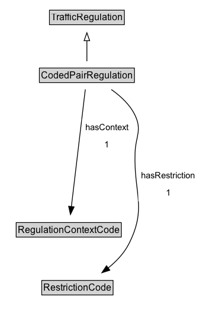

# CodedPairRegulation

A restriction defined by a code.

**IRI**: `https://w3id.org/itsdata/regulation/v1/CodedPairRegulation`

## Diagram

=== "SVG (interactive)"

    <!-- Generated by graphviz version 14.1.3 (20260303.0454)
     -->
    <!-- Pages: 1 -->
    <svg width="255pt" height="401pt"
     viewBox="0.00 0.00 255.00 401.00" xmlns="http://www.w3.org/2000/svg" xmlns:xlink="http://www.w3.org/1999/xlink">
    <g id="graph0" class="graph" transform="scale(1 1) rotate(0) translate(4 397)">
    <polygon fill="white" stroke="none" points="-4,4 -4,-397 251.4,-397 251.4,4 -4,4"/>
    <g id="clust3" class="cluster">
    <title>cluster_associated</title>
    </g>
    <!-- TrafficRegulation -->
    <g id="node1" class="node">
    <title>TrafficRegulation</title>
    <g id="a_node1"><a xlink:href="../TrafficRegulation" xlink:title="&lt;TABLE&gt;">
    <polygon fill="lightgray" stroke="none" points="59.62,-366.88 59.62,-383.12 152.38,-383.12 152.38,-366.88 59.62,-366.88"/>
    <text xml:space="preserve" text-anchor="start" x="60.62" y="-370.88" font-family="Arial" font-size="12.00">TrafficRegulation</text>
    <polygon fill="none" stroke="black" points="58.62,-365.88 58.62,-384.12 153.38,-384.12 153.38,-365.88 58.62,-365.88"/>
    </a>
    </g>
    </g>
    <!-- CodedPairRegulation -->
    <g id="node2" class="node">
    <title>CodedPairRegulation</title>
    <g id="a_node2"><a xlink:href="../CodedPairRegulation" xlink:title="&lt;TABLE&gt;">
    <polygon fill="lightgray" stroke="none" points="46.88,-293.88 46.88,-310.12 165.12,-310.12 165.12,-293.88 46.88,-293.88"/>
    <text xml:space="preserve" text-anchor="start" x="47.88" y="-297.88" font-family="Arial" font-size="12.00">CodedPairRegulation</text>
    <polygon fill="none" stroke="black" points="45.88,-292.88 45.88,-311.12 166.12,-311.12 166.12,-292.88 45.88,-292.88"/>
    </a>
    </g>
    </g>
    <!-- CodedPairRegulation&#45;&gt;TrafficRegulation -->
    <g id="edge1" class="edge">
    <title>CodedPairRegulation&#45;&gt;TrafficRegulation</title>
    <path fill="none" stroke="black" d="M106,-319.71C106,-327.47 106,-336.92 106,-345.74"/>
    <polygon fill="none" stroke="black" points="102.5,-345.66 106,-355.66 109.5,-345.66 102.5,-345.66"/>
    </g>
    <!-- Invis -->
    <!-- CodedPairRegulation&#45;&gt;Invis -->
    <!-- RegulationContextCode -->
    <g id="node4" class="node">
    <title>RegulationContextCode</title>
    <g id="a_node4"><a xlink:href="../RegulationContextCode" xlink:title="&lt;TABLE&gt;">
    <polygon fill="lightgray" stroke="none" points="17.5,-98.88 17.5,-115.12 148.5,-115.12 148.5,-98.88 17.5,-98.88"/>
    <text xml:space="preserve" text-anchor="start" x="18.5" y="-102.88" font-family="Arial" font-size="12.00">RegulationContextCode</text>
    <polygon fill="none" stroke="black" points="16.5,-97.88 16.5,-116.12 149.5,-116.12 149.5,-97.88 16.5,-97.88"/>
    </a>
    </g>
    </g>
    <!-- CodedPairRegulation&#45;&gt;RegulationContextCode -->
    <g id="edge5" class="edge">
    <title>CodedPairRegulation&#45;&gt;RegulationContextCode</title>
    <path fill="none" stroke="black" d="M104,-284.21C100.05,-251.06 91.21,-176.89 86.35,-136.14"/>
    <polygon fill="black" stroke="black" points="89.85,-135.91 85.19,-126.39 82.9,-136.74 89.85,-135.91"/>
    <polygon fill="white" stroke="none" points="100.04,-204 100.04,-247 162.79,-247 162.79,-204 100.04,-204"/>
    <text xml:space="preserve" text-anchor="start" x="104.04" y="-232.5" font-family="Arial" font-size="11.00">hasContext</text>
    <text xml:space="preserve" text-anchor="start" x="128.41" y="-211" font-family="Arial" font-size="11.00">1</text>
    </g>
    <!-- RestrictionCode -->
    <g id="node5" class="node">
    <title>RestrictionCode</title>
    <g id="a_node5"><a xlink:href="../RestrictionCode" xlink:title="&lt;TABLE&gt;">
    <polygon fill="lightgray" stroke="none" points="49.88,-25.88 49.88,-42.12 138.12,-42.12 138.12,-25.88 49.88,-25.88"/>
    <text xml:space="preserve" text-anchor="start" x="50.88" y="-29.88" font-family="Arial" font-size="12.00">RestrictionCode</text>
    <polygon fill="none" stroke="black" points="48.88,-24.88 48.88,-43.12 139.12,-43.12 139.12,-24.88 48.88,-24.88"/>
    </a>
    </g>
    </g>
    <!-- CodedPairRegulation&#45;&gt;RestrictionCode -->
    <g id="edge6" class="edge">
    <title>CodedPairRegulation&#45;&gt;RestrictionCode</title>
    <path fill="none" stroke="black" d="M136.92,-284.06C148.6,-275.89 160.61,-264.92 167,-251.5 176.08,-232.44 167.73,-225.1 167,-204 165.22,-152.8 182.36,-134.6 159,-89 152.95,-77.18 143.05,-66.98 132.78,-58.71"/>
    <polygon fill="black" stroke="black" points="135.07,-56.05 124.97,-52.87 130.88,-61.66 135.07,-56.05"/>
    <polygon fill="white" stroke="none" points="171.15,-143 171.15,-186 247.4,-186 247.4,-143 171.15,-143"/>
    <text xml:space="preserve" text-anchor="start" x="175.15" y="-171.5" font-family="Arial" font-size="11.00">hasRestriction</text>
    <text xml:space="preserve" text-anchor="start" x="206.27" y="-150" font-family="Arial" font-size="11.00">1</text>
    </g>
    <!-- Invis&#45;&gt;RegulationContextCode -->
    <!-- RegulationContextCode&#45;&gt;RestrictionCode -->
    </g>
    </svg>

=== "PNG"

    

## Formalization for CodedPairRegulation

| Property | Constraint |
|----------|------------|
| [hasContext](../properties/hasContext.md) | exactly 1 |
| [hasRestriction](../properties/hasRestriction.md) | exactly 1 |
| subClassOf | [TrafficRegulation](TrafficRegulation.md) |

## Other annotations

| Property | Value |
|----------|-------|
| ReqView ID | its-regulation-8 |
| [rdfs:seeAlso](https://w3id.org/citydata/imported/rdfs/seeAlso) | DATEX-II AlternateRoadOrCarriagewayOrLaneLayout |
| [skos:editorsNote](https://w3id.org/citydata/imported/skos/editorsNote) | The type of temporary markings and locations are defined by the associated traffic control devices. |

