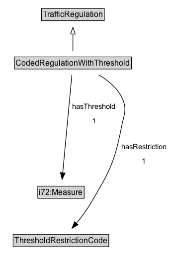

# CodedRegulationWithThreshold

A restriction defined by a code coupled with a threshold value.

**IRI**: `https://w3id.org/itsdata/regulation/v1/CodedRegulationWithThreshold`

## Diagram

=== "SVG (interactive)"

    <!-- Generated by graphviz version 14.1.3 (20260303.0454)
     -->
    <!-- Pages: 1 -->
    <svg width="259pt" height="401pt"
     viewBox="0.00 0.00 259.00 401.00" xmlns="http://www.w3.org/2000/svg" xmlns:xlink="http://www.w3.org/1999/xlink">
    <g id="graph0" class="graph" transform="scale(1 1) rotate(0) translate(4 397)">
    <polygon fill="white" stroke="none" points="-4,4 -4,-397 255.39,-397 255.39,4 -4,4"/>
    <g id="clust3" class="cluster">
    <title>cluster_associated</title>
    </g>
    <!-- TrafficRegulation -->
    <g id="node1" class="node">
    <title>TrafficRegulation</title>
    <g id="a_node1"><a xlink:href="../TrafficRegulation" xlink:title="&lt;TABLE&gt;">
    <polygon fill="lightgray" stroke="none" points="59.62,-366.88 59.62,-383.12 152.38,-383.12 152.38,-366.88 59.62,-366.88"/>
    <text xml:space="preserve" text-anchor="start" x="60.62" y="-370.88" font-family="Arial" font-size="12.00">TrafficRegulation</text>
    <polygon fill="none" stroke="black" points="58.62,-365.88 58.62,-384.12 153.38,-384.12 153.38,-365.88 58.62,-365.88"/>
    </a>
    </g>
    </g>
    <!-- CodedRegulationWithThreshold -->
    <g id="node2" class="node">
    <title>CodedRegulationWithThreshold</title>
    <g id="a_node2"><a xlink:href="../CodedRegulationWithThreshold" xlink:title="&lt;TABLE&gt;">
    <polygon fill="lightgray" stroke="none" points="18.75,-293.88 18.75,-310.12 193.25,-310.12 193.25,-293.88 18.75,-293.88"/>
    <text xml:space="preserve" text-anchor="start" x="19.75" y="-297.88" font-family="Arial" font-size="12.00">CodedRegulationWithThreshold</text>
    <polygon fill="none" stroke="black" points="17.75,-292.88 17.75,-311.12 194.25,-311.12 194.25,-292.88 17.75,-292.88"/>
    </a>
    </g>
    </g>
    <!-- CodedRegulationWithThreshold&#45;&gt;TrafficRegulation -->
    <g id="edge1" class="edge">
    <title>CodedRegulationWithThreshold&#45;&gt;TrafficRegulation</title>
    <path fill="none" stroke="black" d="M106,-319.71C106,-327.47 106,-336.92 106,-345.74"/>
    <polygon fill="none" stroke="black" points="102.5,-345.66 106,-355.66 109.5,-345.66 102.5,-345.66"/>
    </g>
    <!-- Invis -->
    <!-- CodedRegulationWithThreshold&#45;&gt;Invis -->
    <!-- i72_Measure -->
    <g id="node4" class="node">
    <title>i72_Measure</title>
    <g id="a_node4"><a xlink:href="https://w3id.org/citydata/21972/v1/Measure" xlink:title="&lt;TABLE&gt;">
    <polygon fill="lightgray" stroke="none" points="54,-98.88 54,-115.12 122,-115.12 122,-98.88 54,-98.88"/>
    <text xml:space="preserve" text-anchor="start" x="55" y="-102.88" font-family="Arial" font-size="12.00">i72:Measure</text>
    <polygon fill="none" stroke="black" points="53,-97.88 53,-116.12 123,-116.12 123,-97.88 53,-97.88"/>
    </a>
    </g>
    </g>
    <!-- CodedRegulationWithThreshold&#45;&gt;i72_Measure -->
    <g id="edge6" class="edge">
    <title>CodedRegulationWithThreshold&#45;&gt;i72_Measure</title>
    <path fill="none" stroke="black" d="M104.43,-284.21C101.34,-251.06 94.43,-176.89 90.62,-136.14"/>
    <polygon fill="black" stroke="black" points="94.13,-136.03 89.72,-126.4 87.16,-136.68 94.13,-136.03"/>
    <polygon fill="white" stroke="none" points="101.33,-204 101.33,-247 174.58,-247 174.58,-204 101.33,-204"/>
    <text xml:space="preserve" text-anchor="start" x="105.33" y="-232.5" font-family="Arial" font-size="11.00">hasThreshold</text>
    <text xml:space="preserve" text-anchor="start" x="134.96" y="-211" font-family="Arial" font-size="11.00">1</text>
    </g>
    <!-- ThresholdRestrictionCode -->
    <g id="node5" class="node">
    <title>ThresholdRestrictionCode</title>
    <g id="a_node5"><a xlink:href="../ThresholdRestrictionCode" xlink:title="&lt;TABLE&gt;">
    <polygon fill="lightgray" stroke="none" points="16.88,-25.88 16.88,-42.12 159.12,-42.12 159.12,-25.88 16.88,-25.88"/>
    <text xml:space="preserve" text-anchor="start" x="17.88" y="-29.88" font-family="Arial" font-size="12.00">ThresholdRestrictionCode</text>
    <polygon fill="none" stroke="black" points="15.88,-24.88 15.88,-43.12 160.12,-43.12 160.12,-24.88 15.88,-24.88"/>
    </a>
    </g>
    </g>
    <!-- CodedRegulationWithThreshold&#45;&gt;ThresholdRestrictionCode -->
    <g id="edge5" class="edge">
    <title>CodedRegulationWithThreshold&#45;&gt;ThresholdRestrictionCode</title>
    <path fill="none" stroke="black" d="M145.14,-284.02C158.35,-276.17 171.61,-265.43 179,-251.5 188.89,-232.85 183.07,-224.72 179,-204 168.36,-149.82 160.19,-136.48 132,-89 126.04,-78.97 118.33,-68.83 111.02,-60.08"/>
    <polygon fill="black" stroke="black" points="113.82,-57.97 104.64,-52.69 108.52,-62.55 113.82,-57.97"/>
    <polygon fill="white" stroke="none" points="175.14,-143 175.14,-186 251.39,-186 251.39,-143 175.14,-143"/>
    <text xml:space="preserve" text-anchor="start" x="179.14" y="-171.5" font-family="Arial" font-size="11.00">hasRestriction</text>
    <text xml:space="preserve" text-anchor="start" x="210.27" y="-150" font-family="Arial" font-size="11.00">1</text>
    </g>
    <!-- Invis&#45;&gt;i72_Measure -->
    <!-- i72_Measure&#45;&gt;ThresholdRestrictionCode -->
    </g>
    </svg>

=== "PNG"

    

## Formalization for CodedRegulationWithThreshold

| Property | Constraint |
|----------|------------|
| [hasRestriction](../properties/hasRestriction.md) | exactly 1 |
| [hasThreshold](../properties/hasThreshold.md) | exactly 1 |
| subClassOf | [TrafficRegulation](TrafficRegulation.md) |

## Other annotations

| Property | Value |
|----------|-------|
| ReqView ID | its-regulation-11 |
| [rdfs:seeAlso](https://w3id.org/citydata/imported/rdfs/seeAlso) | DATEX-II MinimumDistanceRestriction, NumericalSpeedValue, StandingOrParkingControl (for durations), SteepHill |

