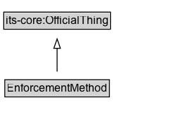

# EnforcementMethod

The enforcement method used to enforce a traffic regulation.

EXAMPLE: enforcement officer, camera, sensor, etc.

**IRI**: `https://w3id.org/itsdata/regulation/v1/EnforcementMethod`

## Diagram

=== "SVG (interactive)"

    <!-- Generated by graphviz version 14.1.3 (20260303.0454)
     -->
    <!-- Pages: 1 -->
    <svg width="209pt" height="132pt"
     viewBox="0.00 0.00 209.00 132.00" xmlns="http://www.w3.org/2000/svg" xmlns:xlink="http://www.w3.org/1999/xlink">
    <g id="graph0" class="graph" transform="scale(1 1) rotate(0) translate(4 128)">
    <polygon fill="white" stroke="none" points="-4,4 -4,-128 204.75,-128 204.75,4 -4,4"/>
    <g id="clust3" class="cluster">
    <title>cluster_associated</title>
    </g>
    <!-- its&#45;core_OfficialThing -->
    <g id="node1" class="node">
    <title>its&#45;core_OfficialThing</title>
    <g id="a_node1"><a xlink:href="https://w3id.org/itsdata/core/v1/OfficialThing" xlink:title="&lt;TABLE&gt;">
    <polygon fill="lightgray" stroke="none" points="1,-97.88 1,-114.12 112.5,-114.12 112.5,-97.88 1,-97.88"/>
    <text xml:space="preserve" text-anchor="start" x="2" y="-101.88" font-family="Arial" font-size="12.00">its&#45;core:OfficialThing</text>
    <polygon fill="none" stroke="black" points="0,-96.88 0,-115.12 113.5,-115.12 113.5,-96.88 0,-96.88"/>
    </a>
    </g>
    </g>
    <!-- EnforcementMethod -->
    <g id="node2" class="node">
    <title>EnforcementMethod</title>
    <g id="a_node2"><a xlink:href="../EnforcementMethod" xlink:title="&lt;TABLE&gt;">
    <polygon fill="lightgray" stroke="none" points="2.12,-25.88 2.12,-42.12 111.38,-42.12 111.38,-25.88 2.12,-25.88"/>
    <text xml:space="preserve" text-anchor="start" x="3.12" y="-29.88" font-family="Arial" font-size="12.00">EnforcementMethod</text>
    <polygon fill="none" stroke="black" points="1.12,-24.88 1.12,-43.12 112.38,-43.12 112.38,-24.88 1.12,-24.88"/>
    </a>
    </g>
    </g>
    <!-- EnforcementMethod&#45;&gt;its&#45;core_OfficialThing -->
    <g id="edge1" class="edge">
    <title>EnforcementMethod&#45;&gt;its&#45;core_OfficialThing</title>
    <path fill="none" stroke="black" d="M56.75,-51.79C56.75,-59.25 56.75,-68.24 56.75,-76.69"/>
    <polygon fill="none" stroke="black" points="53.25,-76.54 56.75,-86.54 60.25,-76.54 53.25,-76.54"/>
    </g>
    <!-- Invis -->
    </g>
    </svg>

=== "PNG"

    

## Specializations of EnforcementMethod

| Class | Description |
|-------|-------------|
| [Composite Enforcement Method](CompositeEnforcementMethod.md) | A method of enforcing a traffic regulation that involves a combination of enforcement methods. |
| [Driving Record Enforcement Method](DrivingRecordEnforcementMethod.md) | A method of enforcing a traffic regulation that involves assigning demerits to a driver's driving record. |
| [Financial Enforcement Method](FinancialEnforcementMethod.md) | A method of enforcing a traffic regulation that involves a financial penalty. |
| [Immobilization Enforcement Method](ImmobilizationEnforcementMethod.md) | A method of enforcing a traffic regulation that involves immobilizing a vehicle. |
| [Towing Enforcement Method](TowingEnforcementMethod.md) | A method of enforcing a traffic regulation that involves towing a vehicle. |

## Formalization for EnforcementMethod

| Property | Constraint |
|----------|------------|
| subClassOf | [its-core:OfficialThing](https://w3id.org/itsdata/core/v1/OfficialThing) |

## Other annotations

| Property | Value |
|----------|-------|
| [dash:abstract](https://w3id.org/citydata/imported/dash/abstract) | true |

