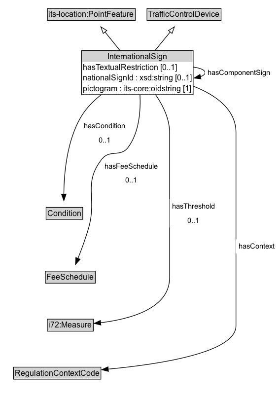

# InternationalSign

A traffic control device that is used to convey information to road users, such as regulatory, warning, or guide signs.

NOTE: The full conceptualization of an InternationalSign includes the conditions and attributes displayed on the sign. In theory, these are redundant with the conditions and attributes of the TrafficRegulation, but could be different (e.g., a sign can omit details or discrepancies can occur).

**IRI**: `https://w3id.org/itsdata/regulation/v1/InternationalSign`

## Diagram

=== "SVG (interactive)"

    <!-- Generated by graphviz version 14.1.3 (20260303.0454)
     -->
    <!-- Pages: 1 -->
    <svg width="426pt" height="606pt"
     viewBox="0.00 0.00 426.00 606.00" xmlns="http://www.w3.org/2000/svg" xmlns:xlink="http://www.w3.org/1999/xlink">
    <g id="graph0" class="graph" transform="scale(1 1) rotate(0) translate(4 601.5)">
    <polygon fill="white" stroke="none" points="-4,4 -4,-601.5 421.75,-601.5 421.75,4 -4,4"/>
    <g id="clust3" class="cluster">
    <title>cluster_associated</title>
    </g>
    <!-- its&#45;location_PointFeature -->
    <g id="node1" class="node">
    <title>its&#45;location_PointFeature</title>
    <g id="a_node1"><a xlink:href="https://w3id.org/itsdata/location/v1/PointFeature" xlink:title="&lt;TABLE&gt;">
    <polygon fill="lightgray" stroke="none" points="69.12,-571.38 69.12,-587.62 200.88,-587.62 200.88,-571.38 69.12,-571.38"/>
    <text xml:space="preserve" text-anchor="start" x="70.12" y="-575.38" font-family="Arial" font-size="12.00">its&#45;location:PointFeature</text>
    <polygon fill="none" stroke="black" points="68.12,-570.38 68.12,-588.62 201.88,-588.62 201.88,-570.38 68.12,-570.38"/>
    </a>
    </g>
    </g>
    <!-- TrafficControlDevice -->
    <g id="node2" class="node">
    <title>TrafficControlDevice</title>
    <g id="a_node2"><a xlink:href="../TrafficControlDevice" xlink:title="&lt;TABLE&gt;">
    <polygon fill="lightgray" stroke="none" points="220.62,-571.38 220.62,-587.62 331.38,-587.62 331.38,-571.38 220.62,-571.38"/>
    <text xml:space="preserve" text-anchor="start" x="221.62" y="-575.38" font-family="Arial" font-size="12.00">TrafficControlDevice</text>
    <polygon fill="none" stroke="black" points="219.62,-570.38 219.62,-588.62 332.38,-588.62 332.38,-570.38 219.62,-570.38"/>
    </a>
    </g>
    </g>
    <!-- InternationalSign -->
    <g id="node3" class="node">
    <title>InternationalSign</title>
    <g id="a_node3"><a xlink:href="../InternationalSign" xlink:title="&lt;TABLE&gt;">
    <polygon fill="lightgray" stroke="none" points="121.12,-507.25 121.12,-523.5 288.88,-523.5 288.88,-507.25 121.12,-507.25"/>
    <text xml:space="preserve" text-anchor="start" x="159.62" y="-511.25" font-family="Arial" font-size="12.00">InternationalSign</text>
    <text xml:space="preserve" text-anchor="start" x="122.12" y="-495" font-family="Arial" font-size="12.00">hasTextualRestriction [0..1]</text>
    <text xml:space="preserve" text-anchor="start" x="122.12" y="-478.75" font-family="Arial" font-size="12.00">nationalSignId : xsd:string [0..1]</text>
    <text xml:space="preserve" text-anchor="start" x="122.12" y="-462.5" font-family="Arial" font-size="12.00">pictogram : its&#45;core:oidstring [1]</text>
    <polygon fill="none" stroke="black" points="120.12,-457.5 120.12,-524.5 289.88,-524.5 289.88,-457.5 120.12,-457.5"/>
    </a>
    </g>
    </g>
    <!-- InternationalSign&#45;&gt;its&#45;location_PointFeature -->
    <g id="edge1" class="edge">
    <title>InternationalSign&#45;&gt;its&#45;location_PointFeature</title>
    <path fill="none" stroke="black" d="M178.79,-524.39C171.13,-533.85 162.88,-544.05 155.63,-553.01"/>
    <polygon fill="none" stroke="black" points="153.02,-550.67 149.45,-560.65 158.46,-555.07 153.02,-550.67"/>
    </g>
    <!-- InternationalSign&#45;&gt;TrafficControlDevice -->
    <g id="edge2" class="edge">
    <title>InternationalSign&#45;&gt;TrafficControlDevice</title>
    <path fill="none" stroke="black" d="M231.59,-524.39C239.35,-533.85 247.72,-544.05 255.08,-553.01"/>
    <polygon fill="none" stroke="black" points="252.3,-555.14 261.35,-560.65 257.71,-550.7 252.3,-555.14"/>
    </g>
    <!-- InternationalSign&#45;&gt;InternationalSign -->
    <g id="edge12" class="edge">
    <title>InternationalSign&#45;&gt;InternationalSign</title>
    <path fill="none" stroke="black" d="M289.75,-499.54C300.67,-498.06 307.88,-495.21 307.88,-491 307.88,-488.5 305.33,-486.48 300.98,-484.94"/>
    <polygon fill="black" stroke="black" points="301.75,-481.52 291.23,-482.78 300.24,-488.36 301.75,-481.52"/>
    <polygon fill="white" stroke="none" points="307.88,-480.25 307.88,-501.75 411.12,-501.75 411.12,-480.25 307.88,-480.25"/>
    <text xml:space="preserve" text-anchor="start" x="311.88" y="-487.25" font-family="Arial" font-size="11.00">hasComponentSign</text>
    </g>
    <!-- Invis -->
    <!-- InternationalSign&#45;&gt;Invis -->
    <!-- Condition -->
    <g id="node5" class="node">
    <title>Condition</title>
    <g id="a_node5"><a xlink:href="../Condition" xlink:title="&lt;TABLE&gt;">
    <polygon fill="lightgray" stroke="none" points="67.12,-268.88 67.12,-285.12 120.88,-285.12 120.88,-268.88 67.12,-268.88"/>
    <text xml:space="preserve" text-anchor="start" x="68.12" y="-272.88" font-family="Arial" font-size="12.00">Condition</text>
    <polygon fill="none" stroke="black" points="66.12,-267.88 66.12,-286.12 121.88,-286.12 121.88,-267.88 66.12,-267.88"/>
    </a>
    </g>
    </g>
    <!-- InternationalSign&#45;&gt;Condition -->
    <g id="edge8" class="edge">
    <title>InternationalSign&#45;&gt;Condition</title>
    <path fill="none" stroke="black" d="M150.23,-457.73C138.64,-448.53 127.63,-437.54 120,-425 97.65,-388.25 93.35,-337.37 93.09,-306.12"/>
    <polygon fill="black" stroke="black" points="96.59,-306.33 93.16,-296.31 89.59,-306.28 96.59,-306.33"/>
    <polygon fill="white" stroke="none" points="120,-377.5 120,-420.5 191,-420.5 191,-377.5 120,-377.5"/>
    <text xml:space="preserve" text-anchor="start" x="124" y="-406" font-family="Arial" font-size="11.00">hasCondition</text>
    <text xml:space="preserve" text-anchor="start" x="146.5" y="-384.5" font-family="Arial" font-size="11.00">0..1</text>
    </g>
    <!-- FeeSchedule -->
    <g id="node6" class="node">
    <title>FeeSchedule</title>
    <g id="a_node6"><a xlink:href="../FeeSchedule" xlink:title="&lt;TABLE&gt;">
    <polygon fill="lightgray" stroke="none" points="66,-171.88 66,-188.12 140,-188.12 140,-171.88 66,-171.88"/>
    <text xml:space="preserve" text-anchor="start" x="67" y="-175.88" font-family="Arial" font-size="12.00">FeeSchedule</text>
    <polygon fill="none" stroke="black" points="65,-170.88 65,-189.12 141,-189.12 141,-170.88 65,-170.88"/>
    </a>
    </g>
    </g>
    <!-- InternationalSign&#45;&gt;FeeSchedule -->
    <g id="edge10" class="edge">
    <title>InternationalSign&#45;&gt;FeeSchedule</title>
    <path fill="none" stroke="black" d="M208.96,-457.59C210.17,-433.28 207.89,-400.38 191,-377.5 179.42,-361.82 163.09,-374.79 151,-359.5 121.81,-322.58 143.77,-300.8 131,-255.5 126.5,-239.55 120.07,-222.19 114.51,-208.25"/>
    <polygon fill="black" stroke="black" points="117.87,-207.23 110.86,-199.29 111.39,-209.87 117.87,-207.23"/>
    <polygon fill="white" stroke="none" points="151,-316.5 151,-359.5 240,-359.5 240,-316.5 151,-316.5"/>
    <text xml:space="preserve" text-anchor="start" x="155" y="-345" font-family="Arial" font-size="11.00">hasFeeSchedule</text>
    <text xml:space="preserve" text-anchor="start" x="186.5" y="-323.5" font-family="Arial" font-size="11.00">0..1</text>
    </g>
    <!-- i72_Measure -->
    <g id="node7" class="node">
    <title>i72_Measure</title>
    <g id="a_node7"><a xlink:href="https://w3id.org/citydata/21972/v1/Measure" xlink:title="&lt;TABLE&gt;">
    <polygon fill="lightgray" stroke="none" points="69,-98.88 69,-115.12 137,-115.12 137,-98.88 69,-98.88"/>
    <text xml:space="preserve" text-anchor="start" x="70" y="-102.88" font-family="Arial" font-size="12.00">i72:Measure</text>
    <polygon fill="none" stroke="black" points="68,-97.88 68,-116.12 138,-116.12 138,-97.88 68,-97.88"/>
    </a>
    </g>
    </g>
    <!-- InternationalSign&#45;&gt;i72_Measure -->
    <g id="edge11" class="edge">
    <title>InternationalSign&#45;&gt;i72_Measure</title>
    <path fill="none" stroke="black" d="M232.65,-457.62C243.76,-441.4 254,-420.82 254,-400 254,-400 254,-400 254,-179 254,-131.96 193.26,-116.03 148.82,-110.67"/>
    <polygon fill="black" stroke="black" points="149.46,-107.22 139.15,-109.65 148.73,-114.18 149.46,-107.22"/>
    <polygon fill="white" stroke="none" points="254,-255.5 254,-298.5 327.25,-298.5 327.25,-255.5 254,-255.5"/>
    <text xml:space="preserve" text-anchor="start" x="258" y="-284" font-family="Arial" font-size="11.00">hasThreshold</text>
    <text xml:space="preserve" text-anchor="start" x="281.62" y="-262.5" font-family="Arial" font-size="11.00">0..1</text>
    </g>
    <!-- RegulationContextCode -->
    <g id="node8" class="node">
    <title>RegulationContextCode</title>
    <g id="a_node8"><a xlink:href="../RegulationContextCode" xlink:title="&lt;TABLE&gt;">
    <polygon fill="lightgray" stroke="none" points="17.5,-25.88 17.5,-42.12 148.5,-42.12 148.5,-25.88 17.5,-25.88"/>
    <text xml:space="preserve" text-anchor="start" x="18.5" y="-29.88" font-family="Arial" font-size="12.00">RegulationContextCode</text>
    <polygon fill="none" stroke="black" points="16.5,-24.88 16.5,-43.12 149.5,-43.12 149.5,-24.88 16.5,-24.88"/>
    </a>
    </g>
    </g>
    <!-- InternationalSign&#45;&gt;RegulationContextCode -->
    <g id="edge9" class="edge">
    <title>InternationalSign&#45;&gt;RegulationContextCode</title>
    <path fill="none" stroke="black" d="M289.64,-470.64C323.67,-457.38 355,-435.53 355,-400 355,-400 355,-400 355,-106 355,-65.51 240.71,-47.68 160.3,-40.14"/>
    <polygon fill="black" stroke="black" points="160.97,-36.69 150.7,-39.28 160.35,-43.66 160.97,-36.69"/>
    <polygon fill="white" stroke="none" points="355,-216 355,-237.5 417.75,-237.5 417.75,-216 355,-216"/>
    <text xml:space="preserve" text-anchor="start" x="359" y="-223" font-family="Arial" font-size="11.00">hasContext</text>
    </g>
    <!-- Invis&#45;&gt;Condition -->
    <!-- Condition&#45;&gt;FeeSchedule -->
    <!-- FeeSchedule&#45;&gt;i72_Measure -->
    <!-- i72_Measure&#45;&gt;RegulationContextCode -->
    </g>
    </svg>

=== "PNG"

    

## Formalization for InternationalSign

| Property | Constraint |
|----------|------------|
| [hasComponentSign](../properties/hasComponentSign.md) | only [InternationalSign](https://w3id.org/itsdata/regulation/v1/InternationalSign) |
| [hasCondition](../properties/hasCondition.md) | max 1 [Condition](https://w3id.org/itsdata/regulation/v1/Condition) |
| [hasContext](../properties/hasContext.md) | only [RegulationContextCode](https://w3id.org/itsdata/regulation/v1/RegulationContextCode) |
| [hasFeeSchedule](../properties/hasFeeSchedule.md) | max 1 [FeeSchedule](https://w3id.org/itsdata/regulation/v1/FeeSchedule) |
| [hasTextualRestriction](../properties/hasTextualRestriction.md) | max 1 [rdf:langString](http://www.w3.org/1999/02/22-rdf-syntax-ns#langString) |
| [hasThreshold](../properties/hasThreshold.md) | max 1 [i72:Measure](https://w3id.org/citydata/21972/v1/Measure) |
| [nationalSignId](../properties/nationalSignId.md) | max 1 xsd:string |
| [pictogram](../properties/pictogram.md) | exactly 1 its-core:oidstring |
| subClassOf | [TrafficControlDevice](TrafficControlDevice.md) |
| subClassOf | [its-location:PointFeature](https://w3id.org/itsdata/location/v1/PointFeature) |

## Other annotations

| Property | Value |
|----------|-------|
| ReqView ID | its-regulation-21 |
| [dash:abstract](https://w3id.org/citydata/imported/dash/abstract) | true |

