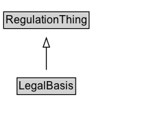

# LegalBasis

A legal basis provides references to the legal documents that authorize an entity to issue the types of regulations covered by a traffic regulation order.

**IRI**: `https://w3id.org/itsdata/regulation/v1/LegalBasis`

## Diagram

=== "SVG (interactive)"

    <!-- Generated by graphviz version 14.1.3 (20260303.0454)
     -->
    <!-- Pages: 1 -->
    <svg width="175pt" height="132pt"
     viewBox="0.00 0.00 175.00 132.00" xmlns="http://www.w3.org/2000/svg" xmlns:xlink="http://www.w3.org/1999/xlink">
    <g id="graph0" class="graph" transform="scale(1 1) rotate(0) translate(4 128)">
    <polygon fill="white" stroke="none" points="-4,4 -4,-128 170.62,-128 170.62,4 -4,4"/>
    <g id="clust3" class="cluster">
    <title>cluster_associated</title>
    </g>
    <!-- RegulationThing -->
    <g id="node1" class="node">
    <title>RegulationThing</title>
    <g id="a_node1"><a xlink:href="../RegulationThing" xlink:title="&lt;TABLE&gt;">
    <polygon fill="lightgray" stroke="none" points="1,-97.88 1,-114.12 92.25,-114.12 92.25,-97.88 1,-97.88"/>
    <text xml:space="preserve" text-anchor="start" x="2" y="-101.88" font-family="Arial" font-size="12.00">RegulationThing</text>
    <polygon fill="none" stroke="black" points="0,-96.88 0,-115.12 93.25,-115.12 93.25,-96.88 0,-96.88"/>
    </a>
    </g>
    </g>
    <!-- LegalBasis -->
    <g id="node2" class="node">
    <title>LegalBasis</title>
    <g id="a_node2"><a xlink:href="../LegalBasis" xlink:title="&lt;TABLE&gt;">
    <polygon fill="lightgray" stroke="none" points="15.62,-25.88 15.62,-42.12 77.62,-42.12 77.62,-25.88 15.62,-25.88"/>
    <text xml:space="preserve" text-anchor="start" x="16.62" y="-29.88" font-family="Arial" font-size="12.00">LegalBasis</text>
    <polygon fill="none" stroke="black" points="14.62,-24.88 14.62,-43.12 78.62,-43.12 78.62,-24.88 14.62,-24.88"/>
    </a>
    </g>
    </g>
    <!-- LegalBasis&#45;&gt;RegulationThing -->
    <g id="edge1" class="edge">
    <title>LegalBasis&#45;&gt;RegulationThing</title>
    <path fill="none" stroke="black" d="M46.62,-51.79C46.62,-59.25 46.62,-68.24 46.62,-76.69"/>
    <polygon fill="none" stroke="black" points="43.13,-76.54 46.63,-86.54 50.13,-76.54 43.13,-76.54"/>
    </g>
    <!-- Invis -->
    </g>
    </svg>

=== "PNG"

    

## Formalization for LegalBasis

| Property | Constraint |
|----------|------------|
| subClassOf | [RegulationThing](RegulationThing.md) |

## Other annotations

| Property | Value |
|----------|-------|
| ReqView ID | its-regulation-22 |

