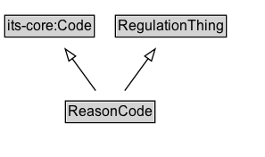

# ReasonCode

A code indicating the reason for the traffic regulation order.

EXAMPLE: construction, maintenance, special event, emergency, weather

**IRI**: `https://w3id.org/itsdata/regulation/v1/ReasonCode`

## Diagram

=== "SVG (interactive)"

    <!-- Generated by graphviz version 14.1.3 (20260303.0454)
     -->
    <!-- Pages: 1 -->
    <svg width="223pt" height="132pt"
     viewBox="0.00 0.00 223.00 132.00" xmlns="http://www.w3.org/2000/svg" xmlns:xlink="http://www.w3.org/1999/xlink">
    <g id="graph0" class="graph" transform="scale(1 1) rotate(0) translate(4 128)">
    <polygon fill="white" stroke="none" points="-4,4 -4,-128 218.62,-128 218.62,4 -4,4"/>
    <g id="clust3" class="cluster">
    <title>cluster_associated</title>
    </g>
    <!-- its&#45;core_Code -->
    <g id="node1" class="node">
    <title>its&#45;core_Code</title>
    <g id="a_node1"><a xlink:href="https://w3id.org/itsdata/core/v1/Code" xlink:title="&lt;TABLE&gt;">
    <polygon fill="lightgray" stroke="none" points="1,-97.88 1,-114.12 74.25,-114.12 74.25,-97.88 1,-97.88"/>
    <text xml:space="preserve" text-anchor="start" x="2" y="-101.88" font-family="Arial" font-size="12.00">its&#45;core:Code</text>
    <polygon fill="none" stroke="black" points="0,-96.88 0,-115.12 75.25,-115.12 75.25,-96.88 0,-96.88"/>
    </a>
    </g>
    </g>
    <!-- RegulationThing -->
    <g id="node2" class="node">
    <title>RegulationThing</title>
    <g id="a_node2"><a xlink:href="../RegulationThing" xlink:title="&lt;TABLE&gt;">
    <polygon fill="lightgray" stroke="none" points="94,-97.88 94,-114.12 185.25,-114.12 185.25,-97.88 94,-97.88"/>
    <text xml:space="preserve" text-anchor="start" x="95" y="-101.88" font-family="Arial" font-size="12.00">RegulationThing</text>
    <polygon fill="none" stroke="black" points="93,-96.88 93,-115.12 186.25,-115.12 186.25,-96.88 93,-96.88"/>
    </a>
    </g>
    </g>
    <!-- ReasonCode -->
    <g id="node3" class="node">
    <title>ReasonCode</title>
    <g id="a_node3"><a xlink:href="../ReasonCode" xlink:title="&lt;TABLE&gt;">
    <polygon fill="lightgray" stroke="none" points="52,-25.88 52,-42.12 125.25,-42.12 125.25,-25.88 52,-25.88"/>
    <text xml:space="preserve" text-anchor="start" x="53" y="-29.88" font-family="Arial" font-size="12.00">ReasonCode</text>
    <polygon fill="none" stroke="black" points="51,-24.88 51,-43.12 126.25,-43.12 126.25,-24.88 51,-24.88"/>
    </a>
    </g>
    </g>
    <!-- ReasonCode&#45;&gt;its&#45;core_Code -->
    <g id="edge1" class="edge">
    <title>ReasonCode&#45;&gt;its&#45;core_Code</title>
    <path fill="none" stroke="black" d="M76.39,-51.79C70.46,-59.93 63.2,-69.9 56.57,-79"/>
    <polygon fill="none" stroke="black" points="53.92,-76.69 50.86,-86.83 59.58,-80.81 53.92,-76.69"/>
    </g>
    <!-- ReasonCode&#45;&gt;RegulationThing -->
    <g id="edge2" class="edge">
    <title>ReasonCode&#45;&gt;RegulationThing</title>
    <path fill="none" stroke="black" d="M100.86,-51.79C106.79,-59.93 114.05,-69.9 120.68,-79"/>
    <polygon fill="none" stroke="black" points="117.67,-80.81 126.39,-86.83 123.33,-76.69 117.67,-80.81"/>
    </g>
    <!-- Invis -->
    </g>
    </svg>

=== "PNG"

    

## Formalization for ReasonCode

| Property | Constraint |
|----------|------------|
| subClassOf | [RegulationThing](RegulationThing.md) |
| subClassOf | [its-core:Code](https://w3id.org/itsdata/core/v1/Code) |

## Other annotations

| Property | Value |
|----------|-------|
| ReqView ID | its-regulation-38 |

