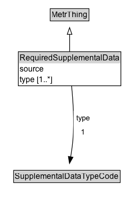

# RequiredSupplementalData

Data that a METR user system needs from a supplemental data provider to determine the current applicability of a regulation.

EXAMPLE: To determine if a time-based parking restriction is currently active, a METR user system needs to know the current date and time.

**IRI**: `https://w3id.org/itsdata/regulation/v1/RequiredSupplementalData`

## Diagram

=== "SVG (interactive)"

    <!-- Generated by graphviz version 14.1.3 (20260303.0454)
     -->
    <!-- Pages: 1 -->
    <svg width="200pt" height="301pt"
     viewBox="0.00 0.00 200.00 301.00" xmlns="http://www.w3.org/2000/svg" xmlns:xlink="http://www.w3.org/1999/xlink">
    <g id="graph0" class="graph" transform="scale(1 1) rotate(0) translate(4 296.75)">
    <polygon fill="white" stroke="none" points="-4,4 -4,-296.75 196,-296.75 196,4 -4,4"/>
    <g id="clust3" class="cluster">
    <title>cluster_associated</title>
    </g>
    <!-- MetrThing -->
    <g id="node1" class="node">
    <title>MetrThing</title>
    <g id="a_node1"><a xlink:href="../MetrThing" xlink:title="&lt;TABLE&gt;">
    <polygon fill="lightgray" stroke="none" points="72,-266.62 72,-282.88 128,-282.88 128,-266.62 72,-266.62"/>
    <text xml:space="preserve" text-anchor="start" x="73" y="-270.62" font-family="Arial" font-size="12.00">MetrThing</text>
    <polygon fill="none" stroke="black" points="71,-265.62 71,-283.88 129,-283.88 129,-265.62 71,-265.62"/>
    </a>
    </g>
    </g>
    <!-- RequiredSupplementalData -->
    <g id="node2" class="node">
    <title>RequiredSupplementalData</title>
    <g id="a_node2"><a xlink:href="../RequiredSupplementalData" xlink:title="&lt;TABLE&gt;">
    <polygon fill="lightgray" stroke="none" points="24.38,-202.5 24.38,-218.75 175.62,-218.75 175.62,-202.5 24.38,-202.5"/>
    <text xml:space="preserve" text-anchor="start" x="25.38" y="-206.5" font-family="Arial" font-size="12.00">RequiredSupplementalData</text>
    <text xml:space="preserve" text-anchor="start" x="25.38" y="-190.25" font-family="Arial" font-size="12.00">source</text>
    <text xml:space="preserve" text-anchor="start" x="25.38" y="-174" font-family="Arial" font-size="12.00">type [1..&#42;]</text>
    <polygon fill="none" stroke="black" points="23.38,-169 23.38,-219.75 176.62,-219.75 176.62,-169 23.38,-169"/>
    </a>
    </g>
    </g>
    <!-- RequiredSupplementalData&#45;&gt;MetrThing -->
    <g id="edge1" class="edge">
    <title>RequiredSupplementalData&#45;&gt;MetrThing</title>
    <path fill="none" stroke="black" d="M100,-219.71C100,-227.97 100,-237.27 100,-245.79"/>
    <polygon fill="none" stroke="black" points="96.5,-245.62 100,-255.62 103.5,-245.62 96.5,-245.62"/>
    </g>
    <!-- Invis -->
    <!-- RequiredSupplementalData&#45;&gt;Invis -->
    <!-- SupplementalDataTypeCode -->
    <g id="node4" class="node">
    <title>SupplementalDataTypeCode</title>
    <g id="a_node4"><a xlink:href="../SupplementalDataTypeCode" xlink:title="&lt;TABLE&gt;">
    <polygon fill="lightgray" stroke="none" points="17.38,-25.88 17.38,-42.12 174.62,-42.12 174.62,-25.88 17.38,-25.88"/>
    <text xml:space="preserve" text-anchor="start" x="18.38" y="-29.88" font-family="Arial" font-size="12.00">SupplementalDataTypeCode</text>
    <polygon fill="none" stroke="black" points="16.38,-24.88 16.38,-43.12 175.62,-43.12 175.62,-24.88 16.38,-24.88"/>
    </a>
    </g>
    </g>
    <!-- RequiredSupplementalData&#45;&gt;SupplementalDataTypeCode -->
    <g id="edge4" class="edge">
    <title>RequiredSupplementalData&#45;&gt;SupplementalDataTypeCode</title>
    <path fill="none" stroke="black" d="M102.93,-169.3C105.09,-148.12 107.27,-116.48 105,-89 104.3,-80.5 102.98,-71.33 101.57,-63"/>
    <polygon fill="black" stroke="black" points="105.06,-62.64 99.83,-53.42 98.17,-63.89 105.06,-62.64"/>
    <polygon fill="white" stroke="none" points="105.96,-89 105.96,-132 134.21,-132 134.21,-89 105.96,-89"/>
    <text xml:space="preserve" text-anchor="start" x="109.96" y="-117.5" font-family="Arial" font-size="11.00">type</text>
    <text xml:space="preserve" text-anchor="start" x="117.09" y="-96" font-family="Arial" font-size="11.00">1</text>
    </g>
    <!-- Invis&#45;&gt;SupplementalDataTypeCode -->
    </g>
    </svg>

=== "PNG"

    

## Formalization for RequiredSupplementalData

| Property | Constraint |
|----------|------------|
| source | only [its-communications:TrustedCyberLocation](https://w3id.org/itsdata/communications/v1/TrustedCyberLocation) |
| subClassOf | MetrThing |
| type | exactly 1 |
| type | min 1 [SupplementalDataTypeCode](https://w3id.org/itsdata/regulation/v1/SupplementalDataTypeCode) |

