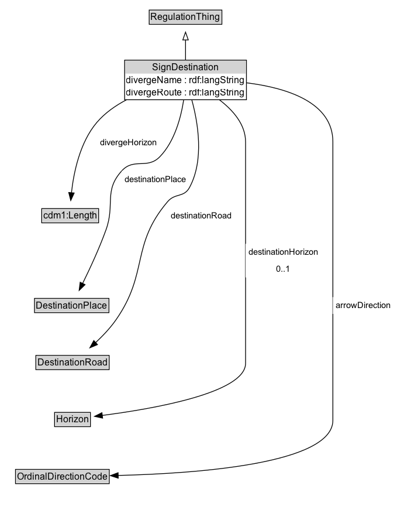

# SignDestination

A destination that is indicated on the road sign.

**IRI**: `https://w3id.org/itsdata/regulation/v1/SignDestination`

## Diagram

=== "SVG (interactive)"

    <!-- Generated by graphviz version 14.1.3 (20260303.0454)
     -->
    <!-- Pages: 1 -->
    <svg width="510pt" height="648pt"
     viewBox="0.00 0.00 510.00 648.00" xmlns="http://www.w3.org/2000/svg" xmlns:xlink="http://www.w3.org/1999/xlink">
    <g id="graph0" class="graph" transform="scale(1 1) rotate(0) translate(4 644.25)">
    <polygon fill="white" stroke="none" points="-4,4 -4,-644.25 505.5,-644.25 505.5,4 -4,4"/>
    <g id="clust3" class="cluster">
    <title>cluster_associated</title>
    </g>
    <!-- RegulationThing -->
    <g id="node1" class="node">
    <title>RegulationThing</title>
    <g id="a_node1"><a xlink:href="../RegulationThing" xlink:title="&lt;TABLE&gt;">
    <polygon fill="lightgray" stroke="none" points="188.38,-614.12 188.38,-630.38 279.62,-630.38 279.62,-614.12 188.38,-614.12"/>
    <text xml:space="preserve" text-anchor="start" x="189.38" y="-618.12" font-family="Arial" font-size="12.00">RegulationThing</text>
    <polygon fill="none" stroke="black" points="187.38,-613.12 187.38,-631.38 280.62,-631.38 280.62,-613.12 187.38,-613.12"/>
    </a>
    </g>
    </g>
    <!-- SignDestination -->
    <g id="node2" class="node">
    <title>SignDestination</title>
    <g id="a_node2"><a xlink:href="../SignDestination" xlink:title="&lt;TABLE&gt;">
    <polygon fill="lightgray" stroke="none" points="156.88,-550 156.88,-566.25 311.12,-566.25 311.12,-550 156.88,-550"/>
    <text xml:space="preserve" text-anchor="start" x="191.25" y="-554" font-family="Arial" font-size="12.00">SignDestination</text>
    <text xml:space="preserve" text-anchor="start" x="157.88" y="-537.75" font-family="Arial" font-size="12.00">divergeName : rdf:langString</text>
    <text xml:space="preserve" text-anchor="start" x="157.88" y="-521.5" font-family="Arial" font-size="12.00">divergeRoute : rdf:langString</text>
    <polygon fill="none" stroke="black" points="155.88,-516.5 155.88,-567.25 312.12,-567.25 312.12,-516.5 155.88,-516.5"/>
    </a>
    </g>
    </g>
    <!-- SignDestination&#45;&gt;RegulationThing -->
    <g id="edge1" class="edge">
    <title>SignDestination&#45;&gt;RegulationThing</title>
    <path fill="none" stroke="black" d="M234,-567.21C234,-575.47 234,-584.77 234,-593.29"/>
    <polygon fill="none" stroke="black" points="230.5,-593.12 234,-603.12 237.5,-593.12 230.5,-593.12"/>
    </g>
    <!-- Invis -->
    <!-- SignDestination&#45;&gt;Invis -->
    <!-- cdm1_Length -->
    <g id="node4" class="node">
    <title>cdm1_Length</title>
    <g id="a_node4"><a xlink:href="https://w3id.org/citydata/part1/v1/Length" xlink:title="&lt;TABLE&gt;">
    <polygon fill="lightgray" stroke="none" points="50.5,-359.88 50.5,-376.12 121.5,-376.12 121.5,-359.88 50.5,-359.88"/>
    <text xml:space="preserve" text-anchor="start" x="51.5" y="-363.88" font-family="Arial" font-size="12.00">cdm1:Length</text>
    <polygon fill="none" stroke="black" points="49.5,-358.88 49.5,-377.12 122.5,-377.12 122.5,-358.88 49.5,-358.88"/>
    </a>
    </g>
    </g>
    <!-- SignDestination&#45;&gt;cdm1_Length -->
    <g id="edge12" class="edge">
    <title>SignDestination&#45;&gt;cdm1_Length</title>
    <path fill="none" stroke="black" d="M158.58,-516.61C144.28,-509.15 130.59,-499.61 120.25,-487.5 98.52,-462.05 90.56,-423.52 87.65,-397.36"/>
    <polygon fill="black" stroke="black" points="91.14,-397.11 86.75,-387.47 84.17,-397.75 91.14,-397.11"/>
    <polygon fill="white" stroke="none" points="120.25,-450.75 120.25,-472.25 201,-472.25 201,-450.75 120.25,-450.75"/>
    <text xml:space="preserve" text-anchor="start" x="124.25" y="-457.75" font-family="Arial" font-size="11.00">divergeHorizon</text>
    </g>
    <!-- DestinationPlace -->
    <g id="node5" class="node">
    <title>DestinationPlace</title>
    <g id="a_node5"><a xlink:href="../DestinationPlace" xlink:title="&lt;TABLE&gt;">
    <polygon fill="lightgray" stroke="none" points="41.25,-244.88 41.25,-261.12 134.75,-261.12 134.75,-244.88 41.25,-244.88"/>
    <text xml:space="preserve" text-anchor="start" x="42.25" y="-248.88" font-family="Arial" font-size="12.00">DestinationPlace</text>
    <polygon fill="none" stroke="black" points="40.25,-243.88 40.25,-262.12 135.75,-262.12 135.75,-243.88 40.25,-243.88"/>
    </a>
    </g>
    </g>
    <!-- SignDestination&#45;&gt;DestinationPlace -->
    <g id="edge10" class="edge">
    <title>SignDestination&#45;&gt;DestinationPlace</title>
    <path fill="none" stroke="black" d="M231.65,-516.62C228.33,-494.84 220.3,-463.33 201,-443.5 184.89,-426.95 167.82,-442.56 152.25,-425.5 128.84,-399.83 143.78,-382.68 132,-350 123.43,-326.21 111.32,-300.19 101.97,-281.24"/>
    <polygon fill="black" stroke="black" points="105.12,-279.71 97.52,-272.33 98.86,-282.84 105.12,-279.71"/>
    <polygon fill="white" stroke="none" points="152.25,-404 152.25,-425.5 239,-425.5 239,-404 152.25,-404"/>
    <text xml:space="preserve" text-anchor="start" x="156.25" y="-411" font-family="Arial" font-size="11.00">destinationPlace</text>
    </g>
    <!-- DestinationRoad -->
    <g id="node6" class="node">
    <title>DestinationRoad</title>
    <g id="a_node6"><a xlink:href="../DestinationRoad" xlink:title="&lt;TABLE&gt;">
    <polygon fill="lightgray" stroke="none" points="43,-171.88 43,-188.12 135,-188.12 135,-171.88 43,-171.88"/>
    <text xml:space="preserve" text-anchor="start" x="44" y="-175.88" font-family="Arial" font-size="12.00">DestinationRoad</text>
    <polygon fill="none" stroke="black" points="42,-170.88 42,-189.12 136,-189.12 136,-170.88 42,-170.88"/>
    </a>
    </g>
    </g>
    <!-- SignDestination&#45;&gt;DestinationRoad -->
    <g id="edge11" class="edge">
    <title>SignDestination&#45;&gt;DestinationRoad</title>
    <path fill="none" stroke="black" d="M241.94,-516.67C249.86,-487.91 258.31,-439.38 239,-404 231.91,-391.02 220.6,-397.26 211,-386 163.49,-330.25 186.83,-295.12 145,-235 137.56,-224.3 127.77,-214 118.47,-205.31"/>
    <polygon fill="black" stroke="black" points="121.04,-202.92 111.26,-198.84 116.36,-208.13 121.04,-202.92"/>
    <polygon fill="white" stroke="none" points="211,-357.25 211,-378.75 297,-378.75 297,-357.25 211,-357.25"/>
    <text xml:space="preserve" text-anchor="start" x="215" y="-364.25" font-family="Arial" font-size="11.00">destinationRoad</text>
    </g>
    <!-- Horizon -->
    <g id="node7" class="node">
    <title>Horizon</title>
    <g id="a_node7"><a xlink:href="../Horizon" xlink:title="&lt;TABLE&gt;">
    <polygon fill="lightgray" stroke="none" points="67,-98.88 67,-115.12 111,-115.12 111,-98.88 67,-98.88"/>
    <text xml:space="preserve" text-anchor="start" x="68" y="-102.88" font-family="Arial" font-size="12.00">Horizon</text>
    <polygon fill="none" stroke="black" points="66,-97.88 66,-116.12 112,-116.12 112,-97.88 66,-97.88"/>
    </a>
    </g>
    </g>
    <!-- SignDestination&#45;&gt;Horizon -->
    <g id="edge9" class="edge">
    <title>SignDestination&#45;&gt;Horizon</title>
    <path fill="none" stroke="black" d="M277,-516.73C294.64,-503.42 311,-485.01 311,-462.5 311,-462.5 311,-462.5 311,-179 311,-140.81 190.31,-120.34 126.91,-112.22"/>
    <polygon fill="black" stroke="black" points="127.63,-108.78 117.28,-111.03 126.78,-115.73 127.63,-108.78"/>
    <polygon fill="white" stroke="none" points="311,-289 311,-332 408.25,-332 408.25,-289 311,-289"/>
    <text xml:space="preserve" text-anchor="start" x="315" y="-317.5" font-family="Arial" font-size="11.00">destinationHorizon</text>
    <text xml:space="preserve" text-anchor="start" x="350.62" y="-296" font-family="Arial" font-size="11.00">0..1</text>
    </g>
    <!-- OrdinalDirectionCode -->
    <g id="node8" class="node">
    <title>OrdinalDirectionCode</title>
    <g id="a_node8"><a xlink:href="../OrdinalDirectionCode" xlink:title="&lt;TABLE&gt;">
    <polygon fill="lightgray" stroke="none" points="16.88,-25.88 16.88,-42.12 135.12,-42.12 135.12,-25.88 16.88,-25.88"/>
    <text xml:space="preserve" text-anchor="start" x="17.88" y="-29.88" font-family="Arial" font-size="12.00">OrdinalDirectionCode</text>
    <polygon fill="none" stroke="black" points="15.88,-24.88 15.88,-43.12 136.12,-43.12 136.12,-24.88 15.88,-24.88"/>
    </a>
    </g>
    </g>
    <!-- SignDestination&#45;&gt;OrdinalDirectionCode -->
    <g id="edge8" class="edge">
    <title>SignDestination&#45;&gt;OrdinalDirectionCode</title>
    <path fill="none" stroke="black" d="M311.96,-538.24C364.03,-531.8 423,-513.3 423,-462.5 423,-462.5 423,-462.5 423,-106 423,-50.27 249.03,-37.86 147.45,-35.37"/>
    <polygon fill="black" stroke="black" points="147.63,-31.87 137.56,-35.16 147.48,-38.87 147.63,-31.87"/>
    <polygon fill="white" stroke="none" points="423,-242.25 423,-263.75 501.5,-263.75 501.5,-242.25 423,-242.25"/>
    <text xml:space="preserve" text-anchor="start" x="427" y="-249.25" font-family="Arial" font-size="11.00">arrowDirection</text>
    </g>
    <!-- Invis&#45;&gt;cdm1_Length -->
    <!-- cdm1_Length&#45;&gt;DestinationPlace -->
    <!-- DestinationPlace&#45;&gt;DestinationRoad -->
    <!-- DestinationRoad&#45;&gt;Horizon -->
    <!-- Horizon&#45;&gt;OrdinalDirectionCode -->
    </g>
    </svg>

=== "PNG"

    

## Formalization for SignDestination

| Property | Constraint |
|----------|------------|
| [arrowDirection](../properties/arrowDirection.md) | only [OrdinalDirectionCode](https://w3id.org/itsdata/regulation/v1/OrdinalDirectionCode) |
| [destinationHorizon](../properties/destinationHorizon.md) | max 1 [Horizon](https://w3id.org/itsdata/regulation/v1/Horizon) |
| [destinationPlace](../properties/destinationPlace.md) | only [DestinationPlace](https://w3id.org/itsdata/regulation/v1/DestinationPlace) |
| [destinationRoad](../properties/destinationRoad.md) | only [DestinationRoad](https://w3id.org/itsdata/regulation/v1/DestinationRoad) |
| [divergeHorizon](../properties/divergeHorizon.md) | only [cdm1:Length](https://w3id.org/citydata/part1/v1/Length) |
| [divergeName](../properties/divergeName.md) | datatype rdf:langString |
| [divergeRoute](../properties/divergeRoute.md) | datatype rdf:langString |
| subClassOf | [RegulationThing](RegulationThing.md) |

## Other annotations

| Property | Value |
|----------|-------|
| ReqView ID | its-regulation-50 |

