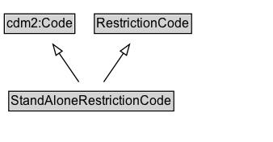

# StandAloneRestrictionCode

A code indicating the type of regulation that does not require any supplemental information.

**IRI**: `https://w3id.org/itsdata/regulation/v1/StandAloneRestrictionCode`

## Diagram

=== "SVG (interactive)"

    <!-- Generated by graphviz version 14.1.3 (20260303.0454)
     -->
    <!-- Pages: 1 -->
    <svg width="254pt" height="132pt"
     viewBox="0.00 0.00 254.00 132.00" xmlns="http://www.w3.org/2000/svg" xmlns:xlink="http://www.w3.org/1999/xlink">
    <g id="graph0" class="graph" transform="scale(1 1) rotate(0) translate(4 128)">
    <polygon fill="white" stroke="none" points="-4,4 -4,-128 249.75,-128 249.75,4 -4,4"/>
    <g id="clust3" class="cluster">
    <title>cluster_associated</title>
    </g>
    <!-- cdm2_Code -->
    <g id="node1" class="node">
    <title>cdm2_Code</title>
    <g id="a_node1"><a xlink:href="https://w3id.org/citydata/part2/v1/Code" xlink:title="&lt;TABLE&gt;">
    <polygon fill="lightgray" stroke="none" points="1,-97.88 1,-114.12 64.5,-114.12 64.5,-97.88 1,-97.88"/>
    <text xml:space="preserve" text-anchor="start" x="2" y="-101.88" font-family="Arial" font-size="12.00">cdm2:Code</text>
    <polygon fill="none" stroke="black" points="0,-96.88 0,-115.12 65.5,-115.12 65.5,-96.88 0,-96.88"/>
    </a>
    </g>
    </g>
    <!-- RestrictionCode -->
    <g id="node2" class="node">
    <title>RestrictionCode</title>
    <g id="a_node2"><a xlink:href="../RestrictionCode" xlink:title="&lt;TABLE&gt;">
    <polygon fill="lightgray" stroke="none" points="84.62,-97.88 84.62,-114.12 172.88,-114.12 172.88,-97.88 84.62,-97.88"/>
    <text xml:space="preserve" text-anchor="start" x="85.62" y="-101.88" font-family="Arial" font-size="12.00">RestrictionCode</text>
    <polygon fill="none" stroke="black" points="83.62,-96.88 83.62,-115.12 173.88,-115.12 173.88,-96.88 83.62,-96.88"/>
    </a>
    </g>
    </g>
    <!-- StandAloneRestrictionCode -->
    <g id="node3" class="node">
    <title>StandAloneRestrictionCode</title>
    <g id="a_node3"><a xlink:href="../StandAloneRestrictionCode" xlink:title="&lt;TABLE&gt;">
    <polygon fill="lightgray" stroke="none" points="5.12,-25.88 5.12,-42.12 156.38,-42.12 156.38,-25.88 5.12,-25.88"/>
    <text xml:space="preserve" text-anchor="start" x="6.12" y="-29.88" font-family="Arial" font-size="12.00">StandAloneRestrictionCode</text>
    <polygon fill="none" stroke="black" points="4.12,-24.88 4.12,-43.12 157.38,-43.12 157.38,-24.88 4.12,-24.88"/>
    </a>
    </g>
    </g>
    <!-- StandAloneRestrictionCode&#45;&gt;cdm2_Code -->
    <g id="edge1" class="edge">
    <title>StandAloneRestrictionCode&#45;&gt;cdm2_Code</title>
    <path fill="none" stroke="black" d="M69.24,-51.79C63.71,-59.85 56.96,-69.69 50.77,-78.71"/>
    <polygon fill="none" stroke="black" points="47.99,-76.58 45.23,-86.81 53.77,-80.54 47.99,-76.58"/>
    </g>
    <!-- StandAloneRestrictionCode&#45;&gt;RestrictionCode -->
    <g id="edge2" class="edge">
    <title>StandAloneRestrictionCode&#45;&gt;RestrictionCode</title>
    <path fill="none" stroke="black" d="M92.26,-51.79C97.79,-59.85 104.54,-69.69 110.73,-78.71"/>
    <polygon fill="none" stroke="black" points="107.73,-80.54 116.27,-86.81 113.51,-76.58 107.73,-80.54"/>
    </g>
    <!-- Invis -->
    </g>
    </svg>

=== "PNG"

    

## Formalization for StandAloneRestrictionCode

| Property | Constraint |
|----------|------------|
| subClassOf | [RestrictionCode](RestrictionCode.md) |
| subClassOf | [cdm2:Code](https://w3id.org/citydata/part2/v1/Code) |

