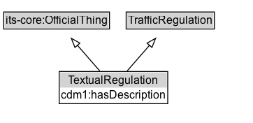

# TextualRegulation

A textual regulation is a rule having the force of law that is established by a regulator through a traffic regulation order.

**IRI**: `https://w3id.org/itsdata/regulation/v1/TextualRegulation`

## Diagram

=== "SVG (interactive)"

    <!-- Generated by graphviz version 14.1.3 (20260303.0454)
     -->
    <!-- Pages: 1 -->
    <svg width="272pt" height="132pt"
     viewBox="0.00 0.00 272.00 132.00" xmlns="http://www.w3.org/2000/svg" xmlns:xlink="http://www.w3.org/1999/xlink">
    <g id="graph0" class="graph" transform="scale(1 1) rotate(0) translate(4 128)">
    <polygon fill="white" stroke="none" points="-4,4 -4,-128 267.75,-128 267.75,4 -4,4"/>
    <g id="clust3" class="cluster">
    <title>cluster_associated</title>
    </g>
    <!-- its&#45;core_OfficialThing -->
    <g id="node1" class="node">
    <title>its&#45;core_OfficialThing</title>
    <g id="a_node1"><a xlink:href="https://w3id.org/itsdata/core/v1/OfficialThing" xlink:title="&lt;TABLE&gt;">
    <polygon fill="lightgray" stroke="none" points="1,-97.88 1,-114.12 112.5,-114.12 112.5,-97.88 1,-97.88"/>
    <text xml:space="preserve" text-anchor="start" x="2" y="-101.88" font-family="Arial" font-size="12.00">its&#45;core:OfficialThing</text>
    <polygon fill="none" stroke="black" points="0,-96.88 0,-115.12 113.5,-115.12 113.5,-96.88 0,-96.88"/>
    </a>
    </g>
    </g>
    <!-- TrafficRegulation -->
    <g id="node2" class="node">
    <title>TrafficRegulation</title>
    <g id="a_node2"><a xlink:href="../TrafficRegulation" xlink:title="&lt;TABLE&gt;">
    <polygon fill="lightgray" stroke="none" points="132.38,-97.88 132.38,-114.12 225.12,-114.12 225.12,-97.88 132.38,-97.88"/>
    <text xml:space="preserve" text-anchor="start" x="133.38" y="-101.88" font-family="Arial" font-size="12.00">TrafficRegulation</text>
    <polygon fill="none" stroke="black" points="131.38,-96.88 131.38,-115.12 226.12,-115.12 226.12,-96.88 131.38,-96.88"/>
    </a>
    </g>
    </g>
    <!-- TextualRegulation -->
    <g id="node3" class="node">
    <title>TextualRegulation</title>
    <g id="a_node3"><a xlink:href="../TextualRegulation" xlink:title="&lt;TABLE&gt;">
    <polygon fill="lightgray" stroke="none" points="60.5,-34 60.5,-50.25 175,-50.25 175,-34 60.5,-34"/>
    <text xml:space="preserve" text-anchor="start" x="69.38" y="-38" font-family="Arial" font-size="12.00">TextualRegulation</text>
    <text xml:space="preserve" text-anchor="start" x="61.5" y="-21.75" font-family="Arial" font-size="12.00">cdm1:hasDescription</text>
    <polygon fill="none" stroke="black" points="59.5,-16.75 59.5,-51.25 176,-51.25 176,-16.75 59.5,-16.75"/>
    </a>
    </g>
    </g>
    <!-- TextualRegulation&#45;&gt;its&#45;core_OfficialThing -->
    <g id="edge1" class="edge">
    <title>TextualRegulation&#45;&gt;its&#45;core_OfficialThing</title>
    <path fill="none" stroke="black" d="M103.12,-51.79C95.87,-60.11 86.97,-70.32 78.91,-79.58"/>
    <polygon fill="none" stroke="black" points="76.44,-77.08 72.51,-86.91 81.72,-81.67 76.44,-77.08"/>
    </g>
    <!-- TextualRegulation&#45;&gt;TrafficRegulation -->
    <g id="edge2" class="edge">
    <title>TextualRegulation&#45;&gt;TrafficRegulation</title>
    <path fill="none" stroke="black" d="M132.38,-51.79C139.63,-60.11 148.53,-70.32 156.59,-79.58"/>
    <polygon fill="none" stroke="black" points="153.78,-81.67 162.99,-86.91 159.06,-77.08 153.78,-81.67"/>
    </g>
    <!-- Invis -->
    </g>
    </svg>

=== "PNG"

    

## Formalization for TextualRegulation

| Property | Constraint |
|----------|------------|
| [cdm1:hasDescription](https://w3id.org/citydata/part1/v1/hasDescription) | exactly 1 |
| subClassOf | [TrafficRegulation](TrafficRegulation.md) |
| subClassOf | [its-core:OfficialThing](https://w3id.org/itsdata/core/v1/OfficialThing) |

## Other annotations

| Property | Value |
|----------|-------|
| ReqView ID | its-regulation-55 |
| [rdfs:seeAlso](https://w3id.org/citydata/imported/rdfs/seeAlso) | DATEX-II TextualRegulation |

