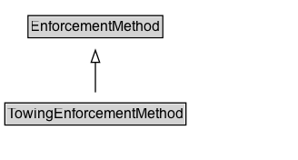

# TowingEnforcementMethod

A method of enforcing a traffic regulation that involves towing a vehicle.

**IRI**: `https://w3id.org/itsdata/regulation/v1/TowingEnforcementMethod`

## Diagram

=== "SVG (interactive)"

    <!-- Generated by graphviz version 14.1.3 (20260303.0454)
     -->
    <!-- Pages: 1 -->
    <svg width="246pt" height="132pt"
     viewBox="0.00 0.00 246.00 132.00" xmlns="http://www.w3.org/2000/svg" xmlns:xlink="http://www.w3.org/1999/xlink">
    <g id="graph0" class="graph" transform="scale(1 1) rotate(0) translate(4 128)">
    <polygon fill="white" stroke="none" points="-4,4 -4,-128 241.75,-128 241.75,4 -4,4"/>
    <g id="clust3" class="cluster">
    <title>cluster_associated</title>
    </g>
    <!-- EnforcementMethod -->
    <g id="node1" class="node">
    <title>EnforcementMethod</title>
    <g id="a_node1"><a xlink:href="../EnforcementMethod" xlink:title="&lt;TABLE&gt;">
    <polygon fill="lightgray" stroke="none" points="20.12,-97.88 20.12,-114.12 129.38,-114.12 129.38,-97.88 20.12,-97.88"/>
    <text xml:space="preserve" text-anchor="start" x="21.12" y="-101.88" font-family="Arial" font-size="12.00">EnforcementMethod</text>
    <polygon fill="none" stroke="black" points="19.12,-96.88 19.12,-115.12 130.38,-115.12 130.38,-96.88 19.12,-96.88"/>
    </a>
    </g>
    </g>
    <!-- TowingEnforcementMethod -->
    <g id="node2" class="node">
    <title>TowingEnforcementMethod</title>
    <g id="a_node2"><a xlink:href="../TowingEnforcementMethod" xlink:title="&lt;TABLE&gt;">
    <polygon fill="lightgray" stroke="none" points="1,-25.88 1,-42.12 148.5,-42.12 148.5,-25.88 1,-25.88"/>
    <text xml:space="preserve" text-anchor="start" x="2" y="-29.88" font-family="Arial" font-size="12.00">TowingEnforcementMethod</text>
    <polygon fill="none" stroke="black" points="0,-24.88 0,-43.12 149.5,-43.12 149.5,-24.88 0,-24.88"/>
    </a>
    </g>
    </g>
    <!-- TowingEnforcementMethod&#45;&gt;EnforcementMethod -->
    <g id="edge1" class="edge">
    <title>TowingEnforcementMethod&#45;&gt;EnforcementMethod</title>
    <path fill="none" stroke="black" d="M74.75,-51.79C74.75,-59.25 74.75,-68.24 74.75,-76.69"/>
    <polygon fill="none" stroke="black" points="71.25,-76.54 74.75,-86.54 78.25,-76.54 71.25,-76.54"/>
    </g>
    <!-- Invis -->
    </g>
    </svg>

=== "PNG"

    

## Formalization for TowingEnforcementMethod

| Property | Constraint |
|----------|------------|
| subClassOf | [EnforcementMethod](EnforcementMethod.md) |

