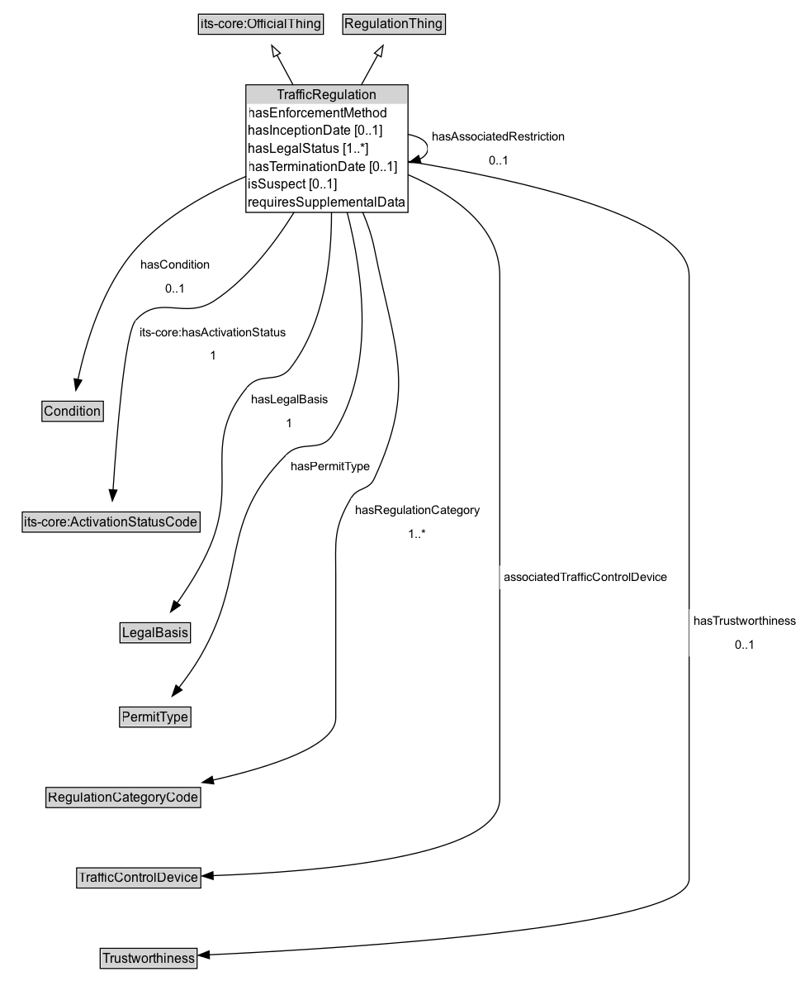

# TrafficRegulation

A traffic regulation is a rule having the force of law that is established by a regulator through a traffic regulation order.

**IRI**: `https://w3id.org/itsdata/regulation/v1/TrafficRegulation`

## Diagram

=== "SVG (interactive)"

    <!-- Generated by graphviz version 14.1.3 (20260303.0454)
     -->
    <!-- Pages: 1 -->
    <svg width="731pt" height="908pt"
     viewBox="0.00 0.00 731.00 908.00" xmlns="http://www.w3.org/2000/svg" xmlns:xlink="http://www.w3.org/1999/xlink">
    <g id="graph0" class="graph" transform="scale(1 1) rotate(0) translate(4 903.75)">
    <polygon fill="white" stroke="none" points="-4,4 -4,-903.75 727,-903.75 727,4 -4,4"/>
    <g id="clust3" class="cluster">
    <title>cluster_associated</title>
    </g>
    <!-- its&#45;core_OfficialThing -->
    <g id="node1" class="node">
    <title>its&#45;core_OfficialThing</title>
    <g id="a_node1"><a xlink:href="https://w3id.org/itsdata/core/v1/OfficialThing" xlink:title="&lt;TABLE&gt;">
    <polygon fill="lightgray" stroke="none" points="177.25,-873.62 177.25,-889.88 288.75,-889.88 288.75,-873.62 177.25,-873.62"/>
    <text xml:space="preserve" text-anchor="start" x="178.25" y="-877.62" font-family="Arial" font-size="12.00">its&#45;core:OfficialThing</text>
    <polygon fill="none" stroke="black" points="176.25,-872.62 176.25,-890.88 289.75,-890.88 289.75,-872.62 176.25,-872.62"/>
    </a>
    </g>
    </g>
    <!-- RegulationThing -->
    <g id="node2" class="node">
    <title>RegulationThing</title>
    <g id="a_node2"><a xlink:href="../RegulationThing" xlink:title="&lt;TABLE&gt;">
    <polygon fill="lightgray" stroke="none" points="308.38,-873.62 308.38,-889.88 399.62,-889.88 399.62,-873.62 308.38,-873.62"/>
    <text xml:space="preserve" text-anchor="start" x="309.38" y="-877.62" font-family="Arial" font-size="12.00">RegulationThing</text>
    <polygon fill="none" stroke="black" points="307.38,-872.62 307.38,-890.88 400.62,-890.88 400.62,-872.62 307.38,-872.62"/>
    </a>
    </g>
    </g>
    <!-- TrafficRegulation -->
    <g id="node3" class="node">
    <title>TrafficRegulation</title>
    <g id="a_node3"><a xlink:href="../TrafficRegulation" xlink:title="&lt;TABLE&gt;">
    <polygon fill="lightgray" stroke="none" points="220.38,-809.5 220.38,-825.75 365.62,-825.75 365.62,-809.5 220.38,-809.5"/>
    <text xml:space="preserve" text-anchor="start" x="247.62" y="-813.5" font-family="Arial" font-size="12.00">TrafficRegulation</text>
    <text xml:space="preserve" text-anchor="start" x="221.38" y="-797.25" font-family="Arial" font-size="12.00">hasEnforcementMethod</text>
    <text xml:space="preserve" text-anchor="start" x="221.38" y="-781" font-family="Arial" font-size="12.00">hasInceptionDate [0..1]</text>
    <text xml:space="preserve" text-anchor="start" x="221.38" y="-764.75" font-family="Arial" font-size="12.00">hasLegalStatus [1..&#42;]</text>
    <text xml:space="preserve" text-anchor="start" x="221.38" y="-748.5" font-family="Arial" font-size="12.00">hasTerminationDate [0..1]</text>
    <text xml:space="preserve" text-anchor="start" x="221.38" y="-732.25" font-family="Arial" font-size="12.00">isSuspect [0..1]</text>
    <text xml:space="preserve" text-anchor="start" x="221.38" y="-716" font-family="Arial" font-size="12.00">requiresSupplementalData</text>
    <polygon fill="none" stroke="black" points="219.38,-711 219.38,-826.75 366.62,-826.75 366.62,-711 219.38,-711"/>
    </a>
    </g>
    </g>
    <!-- TrafficRegulation&#45;&gt;its&#45;core_OfficialThing -->
    <g id="edge1" class="edge">
    <title>TrafficRegulation&#45;&gt;its&#45;core_OfficialThing</title>
    <path fill="none" stroke="black" d="M262.41,-826.4C257.2,-836.04 252,-845.64 247.46,-854.02"/>
    <polygon fill="none" stroke="black" points="244.51,-852.12 242.83,-862.58 250.67,-855.45 244.51,-852.12"/>
    </g>
    <!-- TrafficRegulation&#45;&gt;RegulationThing -->
    <g id="edge2" class="edge">
    <title>TrafficRegulation&#45;&gt;RegulationThing</title>
    <path fill="none" stroke="black" d="M324.1,-826.4C329.4,-836.04 334.68,-845.64 339.3,-854.02"/>
    <polygon fill="none" stroke="black" points="336.12,-855.51 344.01,-862.58 342.25,-852.14 336.12,-855.51"/>
    </g>
    <!-- TrafficRegulation&#45;&gt;TrafficRegulation -->
    <g id="edge14" class="edge">
    <title>TrafficRegulation&#45;&gt;TrafficRegulation</title>
    <path fill="none" stroke="black" d="M366.33,-781.87C377.24,-779.84 384.62,-775.51 384.62,-768.88 384.62,-764.83 381.88,-761.64 377.27,-759.31"/>
    <polygon fill="black" stroke="black" points="378.36,-755.98 367.77,-756.34 376.27,-762.66 378.36,-755.98"/>
    <polygon fill="white" stroke="none" points="384.62,-747.38 384.62,-790.38 513.38,-790.38 513.38,-747.38 384.62,-747.38"/>
    <text xml:space="preserve" text-anchor="start" x="388.62" y="-775.88" font-family="Arial" font-size="11.00">hasAssociatedRestriction</text>
    <text xml:space="preserve" text-anchor="start" x="440" y="-754.38" font-family="Arial" font-size="11.00">0..1</text>
    </g>
    <!-- Invis -->
    <!-- TrafficRegulation&#45;&gt;Invis -->
    <!-- Condition -->
    <g id="node5" class="node">
    <title>Condition</title>
    <g id="a_node5"><a xlink:href="../Condition" xlink:title="&lt;TABLE&gt;">
    <polygon fill="lightgray" stroke="none" points="35.12,-522.38 35.12,-538.62 88.88,-538.62 88.88,-522.38 35.12,-522.38"/>
    <text xml:space="preserve" text-anchor="start" x="36.12" y="-526.38" font-family="Arial" font-size="12.00">Condition</text>
    <polygon fill="none" stroke="black" points="34.12,-521.38 34.12,-539.62 89.88,-539.62 89.88,-521.38 34.12,-521.38"/>
    </a>
    </g>
    </g>
    <!-- TrafficRegulation&#45;&gt;Condition -->
    <g id="edge15" class="edge">
    <title>TrafficRegulation&#45;&gt;Condition</title>
    <path fill="none" stroke="black" d="M219.7,-743.76C185.59,-729.4 146.75,-708.1 120,-678.5 89.01,-644.21 73.69,-591.38 66.84,-559.27"/>
    <polygon fill="black" stroke="black" points="70.28,-558.67 64.9,-549.55 63.42,-560.04 70.28,-558.67"/>
    <polygon fill="white" stroke="none" points="120,-631 120,-674 191,-674 191,-631 120,-631"/>
    <text xml:space="preserve" text-anchor="start" x="124" y="-659.5" font-family="Arial" font-size="11.00">hasCondition</text>
    <text xml:space="preserve" text-anchor="start" x="146.5" y="-638" font-family="Arial" font-size="11.00">0..1</text>
    </g>
    <!-- its&#45;core_ActivationStatusCode -->
    <g id="node6" class="node">
    <title>its&#45;core_ActivationStatusCode</title>
    <g id="a_node6"><a xlink:href="https://w3id.org/itsdata/core/v1/ActivationStatusCode" xlink:title="&lt;TABLE&gt;">
    <polygon fill="lightgray" stroke="none" points="17.25,-421.88 17.25,-438.12 176.75,-438.12 176.75,-421.88 17.25,-421.88"/>
    <text xml:space="preserve" text-anchor="start" x="18.25" y="-425.88" font-family="Arial" font-size="12.00">its&#45;core:ActivationStatusCode</text>
    <polygon fill="none" stroke="black" points="16.25,-420.88 16.25,-439.12 177.75,-439.12 177.75,-420.88 16.25,-420.88"/>
    </a>
    </g>
    </g>
    <!-- TrafficRegulation&#45;&gt;its&#45;core_ActivationStatusCode -->
    <g id="edge13" class="edge">
    <title>TrafficRegulation&#45;&gt;its&#45;core_ActivationStatusCode</title>
    <path fill="none" stroke="black" d="M263.14,-711.12C245.66,-683.08 221.08,-651.06 191,-631 163.65,-612.76 141.01,-637.64 119.25,-613 109.27,-601.7 101.87,-507.4 98.7,-459.17"/>
    <polygon fill="black" stroke="black" points="102.2,-458.98 98.07,-449.22 95.21,-459.42 102.2,-458.98"/>
    <polygon fill="white" stroke="none" points="119.25,-570 119.25,-613 260,-613 260,-570 119.25,-570"/>
    <text xml:space="preserve" text-anchor="start" x="123.25" y="-598.5" font-family="Arial" font-size="11.00">its&#45;core:hasActivationStatus</text>
    <text xml:space="preserve" text-anchor="start" x="186.62" y="-577" font-family="Arial" font-size="11.00">1</text>
    </g>
    <!-- LegalBasis -->
    <g id="node7" class="node">
    <title>LegalBasis</title>
    <g id="a_node7"><a xlink:href="../LegalBasis" xlink:title="&lt;TABLE&gt;">
    <polygon fill="lightgray" stroke="none" points="106,-321.38 106,-337.62 168,-337.62 168,-321.38 106,-321.38"/>
    <text xml:space="preserve" text-anchor="start" x="107" y="-325.38" font-family="Arial" font-size="12.00">LegalBasis</text>
    <polygon fill="none" stroke="black" points="105,-320.38 105,-338.62 169,-338.62 169,-320.38 105,-320.38"/>
    </a>
    </g>
    </g>
    <!-- TrafficRegulation&#45;&gt;LegalBasis -->
    <g id="edge11" class="edge">
    <title>TrafficRegulation&#45;&gt;LegalBasis</title>
    <path fill="none" stroke="black" d="M297.13,-711.11C297.28,-668.2 290.78,-610.04 260,-570 248.18,-554.62 232.54,-567 220.25,-552 178.75,-501.37 212.43,-468.83 187,-408.5 179.16,-389.9 166.99,-370.79 156.62,-356.14"/>
    <polygon fill="black" stroke="black" points="159.73,-354.46 151.02,-348.43 154.06,-358.58 159.73,-354.46"/>
    <polygon fill="white" stroke="none" points="220.25,-509 220.25,-552 298,-552 298,-509 220.25,-509"/>
    <text xml:space="preserve" text-anchor="start" x="224.25" y="-537.5" font-family="Arial" font-size="11.00">hasLegalBasis</text>
    <text xml:space="preserve" text-anchor="start" x="256.12" y="-516" font-family="Arial" font-size="11.00">1</text>
    </g>
    <!-- PermitType -->
    <g id="node8" class="node">
    <title>PermitType</title>
    <g id="a_node8"><a xlink:href="../PermitType" xlink:title="&lt;TABLE&gt;">
    <polygon fill="lightgray" stroke="none" points="105.62,-244.88 105.62,-261.12 168.38,-261.12 168.38,-244.88 105.62,-244.88"/>
    <text xml:space="preserve" text-anchor="start" x="106.62" y="-248.88" font-family="Arial" font-size="12.00">PermitType</text>
    <polygon fill="none" stroke="black" points="104.62,-243.88 104.62,-262.12 169.38,-262.12 169.38,-243.88 104.62,-243.88"/>
    </a>
    </g>
    </g>
    <!-- TrafficRegulation&#45;&gt;PermitType -->
    <g id="edge16" class="edge">
    <title>TrafficRegulation&#45;&gt;PermitType</title>
    <path fill="none" stroke="black" d="M311.35,-711.03C325.78,-654.89 337.53,-568.95 298,-509 286.82,-492.05 270.35,-505.37 256,-491 193.54,-428.42 222.4,-384.45 178,-308 172.36,-298.28 165.22,-288.3 158.49,-279.61"/>
    <polygon fill="black" stroke="black" points="161.35,-277.58 152.38,-271.93 155.87,-281.94 161.35,-277.58"/>
    <polygon fill="white" stroke="none" points="256,-469.5 256,-491 336,-491 336,-469.5 256,-469.5"/>
    <text xml:space="preserve" text-anchor="start" x="260" y="-476.5" font-family="Arial" font-size="11.00">hasPermitType</text>
    </g>
    <!-- RegulationCategoryCode -->
    <g id="node9" class="node">
    <title>RegulationCategoryCode</title>
    <g id="a_node9"><a xlink:href="../RegulationCategoryCode" xlink:title="&lt;TABLE&gt;">
    <polygon fill="lightgray" stroke="none" points="38.75,-171.88 38.75,-188.12 177.25,-188.12 177.25,-171.88 38.75,-171.88"/>
    <text xml:space="preserve" text-anchor="start" x="39.75" y="-175.88" font-family="Arial" font-size="12.00">RegulationCategoryCode</text>
    <polygon fill="none" stroke="black" points="37.75,-170.88 37.75,-189.12 178.25,-189.12 178.25,-170.88 37.75,-170.88"/>
    </a>
    </g>
    </g>
    <!-- TrafficRegulation&#45;&gt;RegulationCategoryCode -->
    <g id="edge17" class="edge">
    <title>TrafficRegulation&#45;&gt;RegulationCategoryCode</title>
    <path fill="none" stroke="black" d="M325.45,-711.19C329.97,-700.64 333.82,-689.48 336,-678.5 354.11,-587.39 375.06,-553.78 336,-469.5 330.8,-458.27 321.01,-462.18 314.75,-451.5 298.56,-423.86 301,-412.78 301,-380.75 301,-380.75 301,-380.75 301,-252 301,-226.75 242.09,-207.73 189.36,-195.76"/>
    <polygon fill="black" stroke="black" points="190.22,-192.37 179.7,-193.64 188.72,-199.2 190.22,-192.37"/>
    <polygon fill="white" stroke="none" points="314.75,-408.5 314.75,-451.5 436,-451.5 436,-408.5 314.75,-408.5"/>
    <text xml:space="preserve" text-anchor="start" x="318.75" y="-437" font-family="Arial" font-size="11.00">hasRegulationCategory</text>
    <text xml:space="preserve" text-anchor="start" x="367.12" y="-415.5" font-family="Arial" font-size="11.00">1..&#42;</text>
    </g>
    <!-- TrafficControlDevice -->
    <g id="node10" class="node">
    <title>TrafficControlDevice</title>
    <g id="a_node10"><a xlink:href="../TrafficControlDevice" xlink:title="&lt;TABLE&gt;">
    <polygon fill="lightgray" stroke="none" points="66.62,-98.88 66.62,-115.12 177.38,-115.12 177.38,-98.88 66.62,-98.88"/>
    <text xml:space="preserve" text-anchor="start" x="67.62" y="-102.88" font-family="Arial" font-size="12.00">TrafficControlDevice</text>
    <polygon fill="none" stroke="black" points="65.62,-97.88 65.62,-116.12 178.38,-116.12 178.38,-97.88 65.62,-97.88"/>
    </a>
    </g>
    </g>
    <!-- TrafficRegulation&#45;&gt;TrafficControlDevice -->
    <g id="edge12" class="edge">
    <title>TrafficRegulation&#45;&gt;TrafficControlDevice</title>
    <path fill="none" stroke="black" d="M366.44,-745.3C407.3,-727.69 450,-698.52 450,-653.5 450,-653.5 450,-653.5 450,-179 450,-126.16 285.35,-112.56 189.36,-109.11"/>
    <polygon fill="black" stroke="black" points="189.63,-105.62 179.53,-108.79 189.41,-112.62 189.63,-105.62"/>
    <polygon fill="white" stroke="none" points="450,-369 450,-390.5 606.5,-390.5 606.5,-369 450,-369"/>
    <text xml:space="preserve" text-anchor="start" x="454" y="-376" font-family="Arial" font-size="11.00">associatedTrafficControlDevice</text>
    </g>
    <!-- Trustworthiness -->
    <g id="node11" class="node">
    <title>Trustworthiness</title>
    <g id="a_node11"><a xlink:href="../Trustworthiness" xlink:title="&lt;TABLE&gt;">
    <polygon fill="lightgray" stroke="none" points="88,-25.88 88,-42.12 174,-42.12 174,-25.88 88,-25.88"/>
    <text xml:space="preserve" text-anchor="start" x="89" y="-29.88" font-family="Arial" font-size="12.00">Trustworthiness</text>
    <polygon fill="none" stroke="black" points="87,-24.88 87,-43.12 175,-43.12 175,-24.88 87,-24.88"/>
    </a>
    </g>
    </g>
    <!-- TrafficRegulation&#45;&gt;Trustworthiness -->
    <g id="edge18" class="edge">
    <title>TrafficRegulation&#45;&gt;Trustworthiness</title>
    <path fill="none" stroke="black" d="M366.42,-757.41C463.39,-741.5 622,-707.24 622,-653.5 622,-653.5 622,-653.5 622,-106 622,-62.36 314.25,-43.32 186.04,-37.28"/>
    <polygon fill="black" stroke="black" points="186.24,-33.78 176.08,-36.82 185.91,-40.78 186.24,-33.78"/>
    <polygon fill="white" stroke="none" points="622,-308 622,-351 723,-351 723,-308 622,-308"/>
    <text xml:space="preserve" text-anchor="start" x="626" y="-336.5" font-family="Arial" font-size="11.00">hasTrustworthiness</text>
    <text xml:space="preserve" text-anchor="start" x="663.5" y="-315" font-family="Arial" font-size="11.00">0..1</text>
    </g>
    <!-- Invis&#45;&gt;Condition -->
    <!-- Condition&#45;&gt;its&#45;core_ActivationStatusCode -->
    <!-- its&#45;core_ActivationStatusCode&#45;&gt;LegalBasis -->
    <!-- LegalBasis&#45;&gt;PermitType -->
    <!-- PermitType&#45;&gt;RegulationCategoryCode -->
    <!-- RegulationCategoryCode&#45;&gt;TrafficControlDevice -->
    <!-- TrafficControlDevice&#45;&gt;Trustworthiness -->
    </g>
    </svg>

=== "PNG"

    

## Specializations of TrafficRegulation

| Class | Description |
|-------|-------------|
| [Coded Pair Regulation](CodedPairRegulation.md) | A restriction defined by a code. |
| [Coded Regulation](CodedRegulation.md) | A restriction defined by a code. |
| [Coded Regulation With Fee](CodedRegulationWithFee.md) | A condition defined by a code. |
| [Coded Regulation With Threshold](CodedRegulationWithThreshold.md) | A restriction defined by a code coupled with a threshold value. |
| [Textual Regulation](TextualRegulation.md) | A textual regulation is a rule having the force of law that is established by a regulator through a traffic regulation order. |

## Formalization for TrafficRegulation

| Property | Constraint |
|----------|------------|
| [associatedTrafficControlDevice](../properties/associatedTrafficControlDevice.md) | only [TrafficControlDevice](https://w3id.org/itsdata/regulation/v1/TrafficControlDevice) |
| [hasAssociatedRestriction](../properties/hasAssociatedRestriction.md) | max 1 [TrafficRegulation](https://w3id.org/itsdata/regulation/v1/TrafficRegulation) |
| [hasCondition](../properties/hasCondition.md) | max 1 [Condition](https://w3id.org/itsdata/regulation/v1/Condition) |
| [hasInceptionDate](../properties/hasInceptionDate.md) | max 1 [xsd:date](http://www.w3.org/2001/XMLSchema#date) |
| [hasLegalBasis](../properties/hasLegalBasis.md) | exactly 1 |
| [hasPermitType](../properties/hasPermitType.md) | only [PermitType](https://w3id.org/itsdata/regulation/v1/PermitType) |
| [hasRegulationCategory](../properties/hasRegulationCategory.md) | min 1 [RegulationCategoryCode](https://w3id.org/itsdata/regulation/v1/RegulationCategoryCode) |
| [hasTerminationDate](../properties/hasTerminationDate.md) | max 1 [xsd:date](http://www.w3.org/2001/XMLSchema#date) |
| [hasTrustworthiness](../properties/hasTrustworthiness.md) | max 1 [Trustworthiness](https://w3id.org/itsdata/regulation/v1/Trustworthiness) |
| [isSuspect](../properties/isSuspect.md) | max 1 [SuspectStatusCode](https://w3id.org/itsdata/regulation/v1/SuspectStatusCode) |
| [its-core:hasActivationStatus](https://w3id.org/itsdata/core/v1/hasActivationStatus) | exactly 1 [its-core:ActivationStatusCode](https://w3id.org/itsdata/core/v1/ActivationStatusCode) |
| hasEnforcementMethod | only [EnforcementMethod](https://w3id.org/itsdata/regulation/v1/EnforcementMethod) |
| hasLegalStatus | min 1 [LegalStatusCode](https://w3id.org/itsdata/regulation/v1/LegalStatusCode) |
| requiresSupplementalData | only [RequiredSupplementalData](https://w3id.org/itsdata/regulation/v1/RequiredSupplementalData) |
| subClassOf | [RegulationThing](RegulationThing.md) |
| subClassOf | [its-core:OfficialThing](https://w3id.org/itsdata/core/v1/OfficialThing) |

## Other annotations

| Property | Value |
|----------|-------|
| ReqView ID | its-regulation-59 |
| [dash:abstract](https://w3id.org/citydata/imported/dash/abstract) | true |
| [skos:editorialNote](https://w3id.org/citydata/imported/skos/editorialNote) | The latest release of DATEX-II assigns a legalBasis to each condition rather than to the regulation. This seems odd; I have added a link for both in this model. |
| [skos:editorsNote](https://w3id.org/citydata/imported/skos/editorsNote) | It is unclear if PermitInformation needs to be associated directly with TrafficRegulation and why. It seems as if PermitCondition is a more appropriate way to describe the association. |

